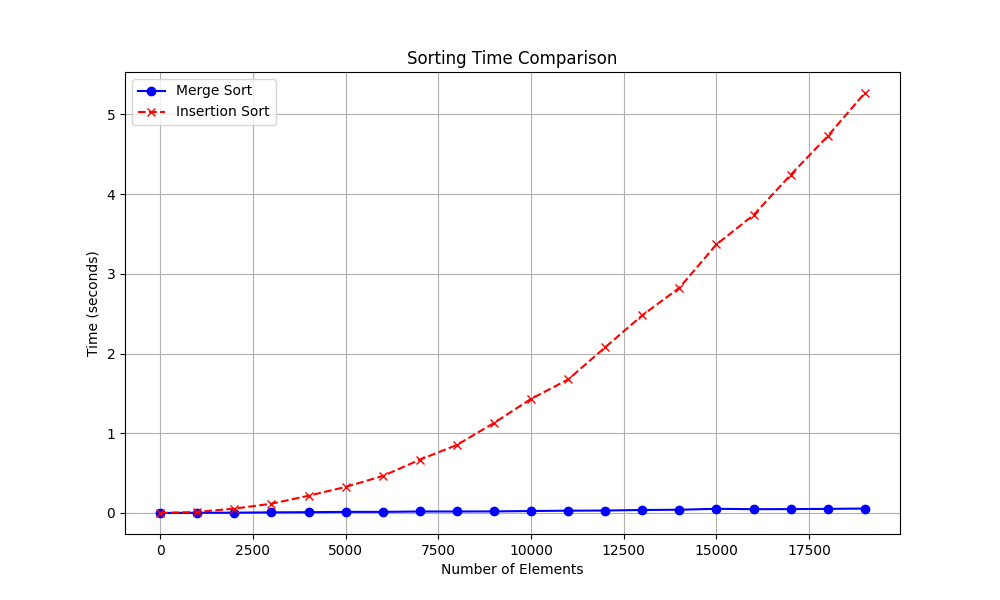

## Comparing Merge Sort with Insertion Sort on Linked Lists in Python ##

This repo includes code that creates a linked list and performs two sorting algorithms on the list using merge sort and insertion sort.
Link lists of various lengths are created and the time required for sorting is recorded.
A figure with plots is made showing the differences in sorting time between the two algorigms and how the reqired time changes as the lenght of the list increases.
You can clearly see how the time complexity of the insertion sort, $O(n^2)$, causes the sorting to become much slower than merge sort (time complexity $O(n \log n)$ ) as the lengths grow larger.

